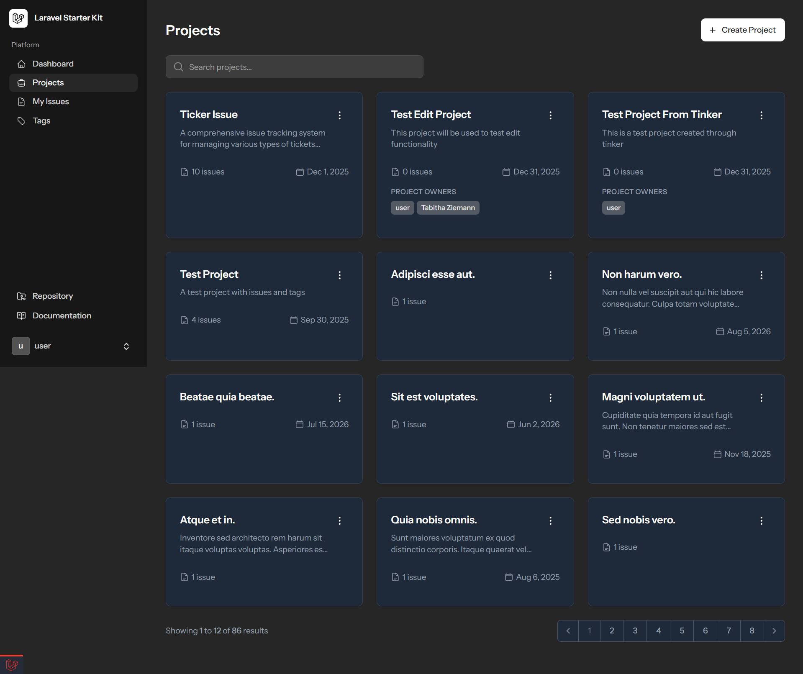
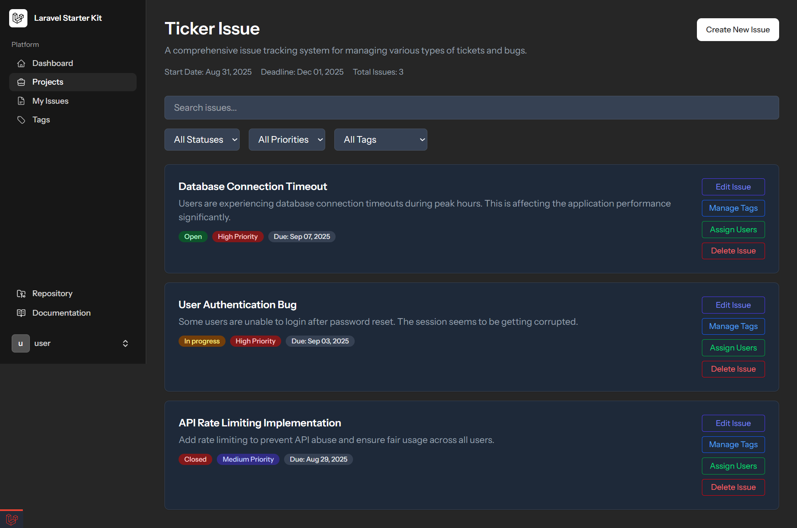
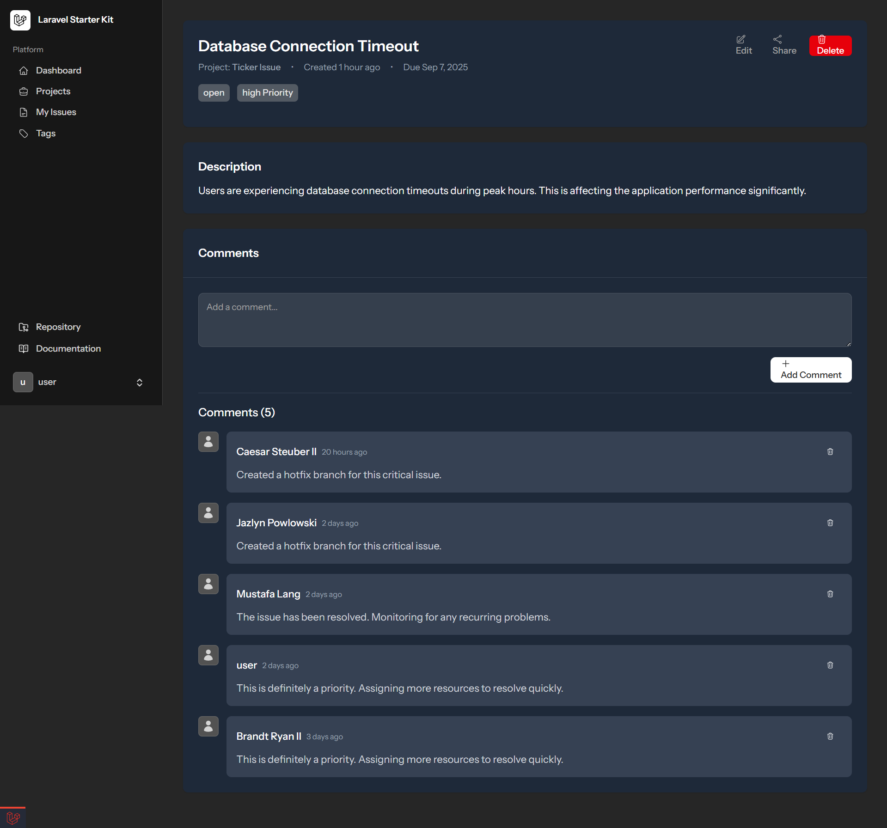
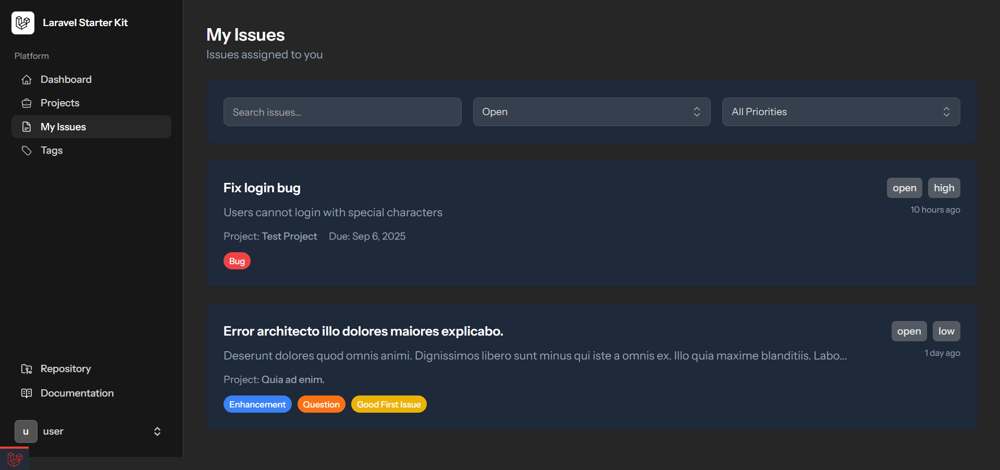
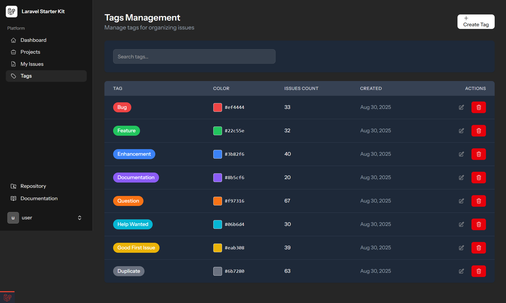
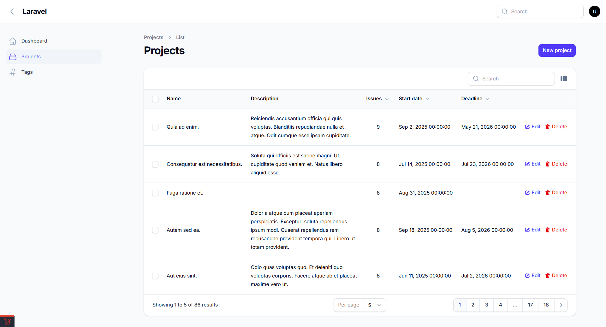
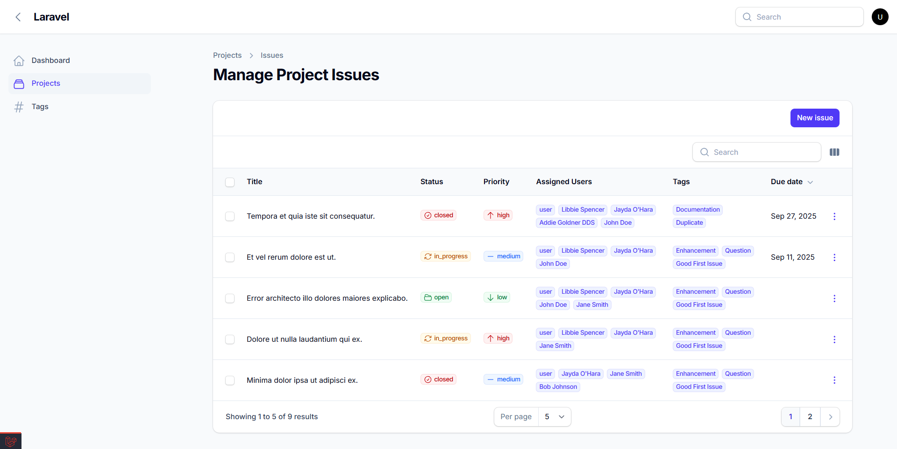
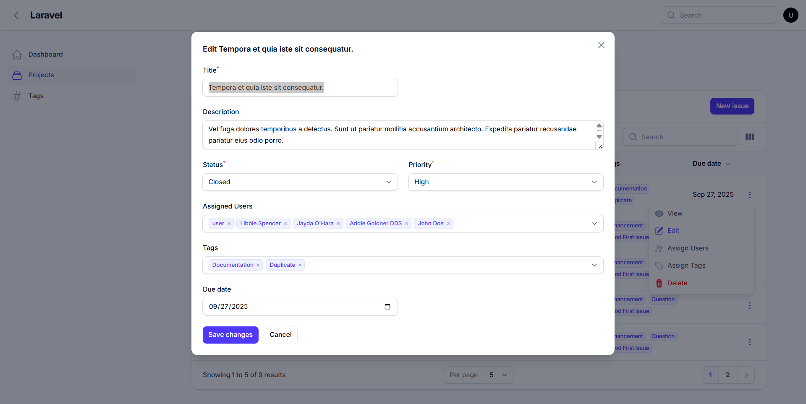
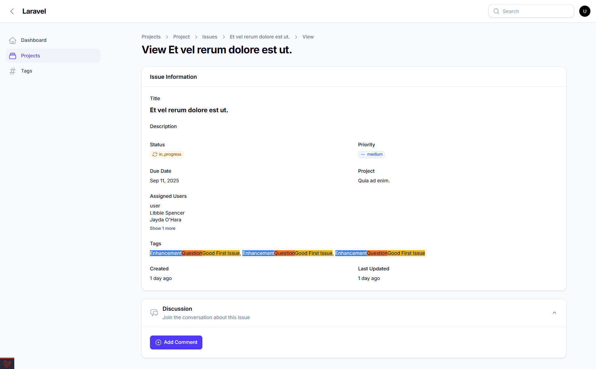
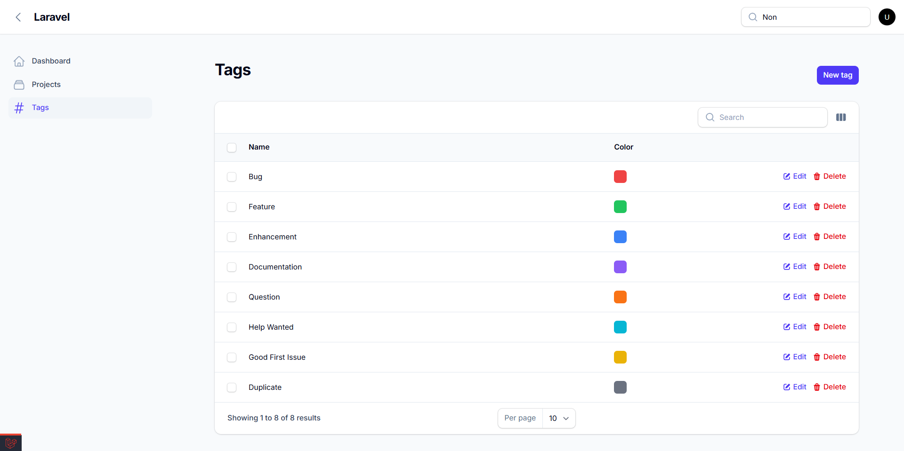

# Issue-Tracker

A modern, full-featured Issue Tracker built with Laravel 12 and Livewire 3 that enables teams to efficiently manage projects, issues, tags, and collaborative workflows. Features real-time interactions, advanced filtering, multi-user project ownership.

## Screenshots













## Filamentphp Version











## Installation

```bash
cp .env.example .env
composer install
php artisan key:generate
php artisan migrate --seed
npm run build
```

## User

- Email: <user@example.com>
- Password: password

user@example.com:password
